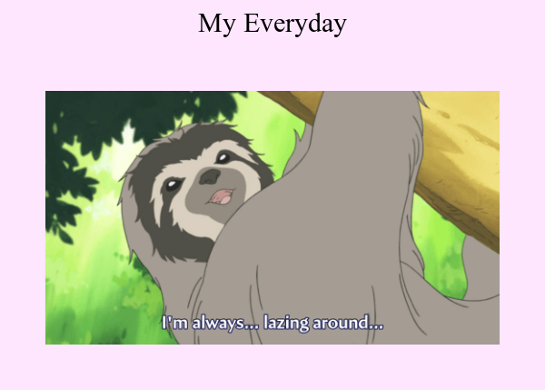

# Hello
Welcome to my test page for A1
## Purpose
1. Portray the meme that I have created using R [magick package](https://cran.r-project.org/web/packages/magick/vignettes/intro.html) and [dplyr package](https://cran.r-project.org/web/packages/dplyr/vignettes/dplyr.html)
2. The R codes for the meme
## Meme 

## Inspiration 
* I always procrastinate, and I should **stop procrastinating**
* I hope covid will be over soon and I can start studying in the library  
## R Code
*Below is the R code that I used to create the meme*
```r
#Part A
library(magick)
library(dplyr)

#Meme
#title of the meme
title <- image_blank(width = 600, 
                     height = 50, 
                     color = "#ffe6ff") %>%
  image_annotate(text = "My Everyday",
                 color = "#000000",
                 size = 30,
                 font = "Times",
                 gravity = "center") 

#meme image
daily <- image_read('https://i0.wp.com/blackandyellowotakugamers.com/wp-content/uploads/2018/08/Sem.png?resize=519%2C290&ssl=1')
daily <- image_scale(daily, "500")
daily <- image_border(daily,"#ffe6ff", "50x50" )

#combine
together <- c(title, daily) %>%
  image_append(stack = TRUE)
print(together)

image_write(together, path = "together.png", format = "png")
```
